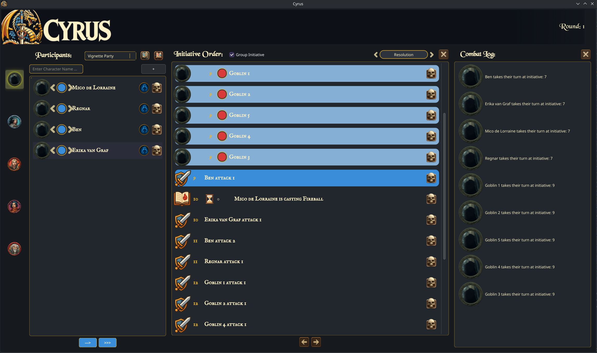

## What is Cyrus?

Cyrus is a feature rich initiative and combat tracker for AD&D 2nd edition. It supports the AD&D 2nd edition combat sequence including all phases and extra optional rules such as indidual initiative, weapon speed to attacks, group initiative and initiative modifiers for misc. actions. 

## How to use Cyrus for your sessions:

There is also a rostering system so you can build out your encounters during your prep, save them off and then load them in at session time for quick combat startup. There is also a clone button for cloning mmosters in your roster, it will number the monsters if there is more than one monster with the same name. For example: To build out a random encounter of a drow surface raiding party you could: 1. Add in a drow fighter. Click clone 4 times. You now have 5 numbered drow fighters. Then add in a priestess of Lloth. You how have a quickly setup 6 enemy encounter.

To determine if a character is a pc or a npc/monster there is a faction coloring system. For blue colored characters they are pc controlled and are tasked in the Player Resolution combat sequence step. For non Blue (Red, Gray purple, orange etc) they are tasked in the NPC Resolution step.

Group initiative is a checkbox so that you can control which initiative system is used on a per round basis. You can also choose to keep one initiative for the entire combat or to reroll initiative every round. Group initiative is per faction based so you can have Gray(town guard) helping the pcs(Blue) in combat against the Red(Orc raiders) and you will get 3 seperate grouped initiatives. One for PCs, one for the Town Guard and one for the Orc Raiders.

Spells add their casting time to the initiative and then if they have a duration(rounds) start counting down their rounds once they are cast. For example a shield spell lasting 10 rounds will cast and then last for 10 rounds in the initiative before falling off. This automates tracking the durations of effects.

Weapons add their speed to the attack and put a new card into the initiative and then resolve as the current initiative passes the card. Attacks are supported in half attack increments so a fighter with 5/2 attacks who attacks on the first round will put 2 attack cardss into the initiative and then on the second round if he attacks again it will be 3 cards and so on. Ex: Ragnar has 5/2 attacks a round and is initiative 3 with weapon speed 4. His attack cards will then be attack 1 at initiative 7 and attack 2 at initiative 11. Each attack adds the weapon speed value to initiative the attack resolves at.

To support haste and other buffs which modify attack speed simply change the attack amount of the character affected. If Ragnar gets hasted a haste card will be put into the order and then you up his attacks from 5/2 to 7/2 and move it back down when the haste expires. 

To remmove characters from the roster or the initiative order click the skull icon to delete them.

To clear the combat log or initiative order click the 'X' button at the top right of those components.

There is no modeling of individual effects or dice rolls. How Cyrus helps is by tracking who is doing what, what has been done and when they resolve in the actual resolution step.

## Preview:



Dependencies:
```
make
cmake 3.28.3
qt6.9
```
Build Guide:

To build:
```
# make build directory if doesn't already exist
mkdir build
cd build
# generate cmake files
cmake ..
# compile
make
```

## Project Trello Board:
[Located Here](https://trello.com/invite/b/68bbd304d3e025eda942d0c7/ATTI93e6d614c5540b3da8ed7a33a41a0e6689DAEC3A/project-cyrus)

## Why is Cyrus needed:

2nd edition dungeons and dragonss has the most robust initiative system for any edition of D&D. It is also the most complicated system> On top of that there is an individual initiative variant rule whick makes sit even more crunch heavy. This complexity slows sessions down which causes dms to usually just house rule the initiative to keep things going faster.

The thing is if you put the crunchyness aside its actually a really cool system from a functionality perspective. Spells have variable cast times before they go off which makes handling spell interruptions super clean. Faster spells are way harder to interrupt because they go off faster so the window to get a hit in is much shorter.

Another nice thing about 2e initiative is attack ssspread out across the round instead of all going at once. Subsequent systems have all attack in a round get rolled at the same time and for good reason, the tracking is just too much. 

Another nice thing is there is a segment system. Each ssegment is a tenth of a round and each round progresses in segments 1 - 10. This makes it so characters can have simultaneous actions and there are even tie breaks for weapons based on a weapon speed stat.

None of this functionality is supported is subsequent lighter weight systems.


## How Cyrus helps:

Cyrus tracks when character will take their turns in the initiative. It tracks when spells will resolve handling the delay and it spreads out attacks across the round for sharacters with multiple attacks. It also has a roster functionality which allows dms to pre create groups of characters to add to the initiative to allow the combat to be setup much faster.

## What cyrus doesn't do: 

Cyrus does not replacing you or your players rolling dice. It is there to speed up the pace of combats and getting combats started faster, but it does not to turn the ttrpg into a video game.

## How Initiative Words in AD&D 2e


## Contributors

If you want to contribute to cyrus, please read the [contribution guidelines](CONTRIBUTING.md).

Thanks goes to these wonderful people:

<!-- ALL-CONTRIBUTORS-LIST:START - Do not remove or modify this section -->
<!-- prettier-ignore-start -->
<!-- markdownlint-disable -->
<table>
  <tbody>
    <tr>
      <td align="center" valign="top" width="14.28%"><a href="https://breedurbin.carrd.co"><br /><sub><b>Bree Lynne Durbin</b></sub></a><br /><a href="#code-BreeDurbin" title="Code">💻</a></td>
    </tr>
  </tbody>
</table>

<!-- markdownlint-restore -->
<!-- prettier-ignore-end -->

<!-- ALL-CONTRIBUTORS-LIST:END -->

