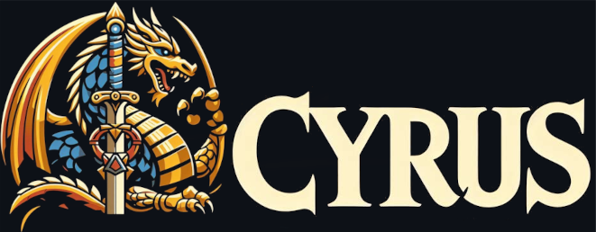

## What is Cyrus?

Cyrus is an initiative and combat action tracker for the individual initiative system in AD&D 2nd edition.

## Preview:


Dependencies:
```
make
cmake 3.28.3
qt6.9
```
Build Guide:

To build:
```
# make build directory if doesn't already exist
mkdir build
cd build
# generate cmake files
cmake ..
# compile
make
```

## Project Trello Board:
[Located Here](https://trello.com/invite/b/68bbd304d3e025eda942d0c7/ATTI93e6d614c5540b3da8ed7a33a41a0e6689DAEC3A/project-cyrus)

## Why is Cyrus needed:

2nd edition dungeons and dragonss has the most robust initiative system for any edition of D&D. It is also the most complicated system> On top of that there is an individual initiative variant rule whick makes sit even more crunch heavy. This complexity slows sessions down which causes dms to usually just house rule the initiative to keep things going faster.

The thing is if you put the crunchyness aside its actually a really cool system from a functionality perspective. Spells have variable cast times before they go off which makes handling spell interruptions super clean. Faster spells are way harder to interrupt because they go off faster so the window to get a hit in is much shorter.

Another nice thing about 2e initiative is attack ssspread out across the round instead of all going at once. Subsequent systems have all attack in a round get rolled at the same time and for good reason, the tracking is just too much. 

Another nice thing is there is a segment system. Each ssegment is a tenth of a round and each round progresses in segments 1 - 10. This makes it so characters can have simultaneous actions and there are even tie breaks for weapons based on a weapon speed stat.

None of this functionality is supported is subsequent lighter weight systems.


## How Cyrus helps:

Cyrus tracks when character will take their turns in the initiative. It tracks when spells will resolve handling the delay and it spreads out attacks across the round for sharacters with multiple attacks. It also has a roster functionality which allows dms to pre create groups of characters to add to the initiative to allow the combat to be setup much faster.

## What cyrus doesn't do: 

Cyrus does not replacing you or your players rolling dice. It is there to speed up the pace of combats and getting combats started faster, but it does not to turn the ttrpg into a video game.


## Contributors

If you want to contribute to cyrus, please read the [contribution guidelines](CONTRIBUTING.md).

Thanks goes to these wonderful people:

<!-- ALL-CONTRIBUTORS-LIST:START - Do not remove or modify this section -->
<!-- prettier-ignore-start -->
<!-- markdownlint-disable -->
<table>
  <tbody>
    <tr>
      <td align="center" valign="top" width="14.28%"><a href="https://breedurbin.carrd.co"><br /><sub><b>Bree Lynne Durbin</b></sub></a><br /><a href="#code-BreeDurbin" title="Code">💻</a></td>
    </tr>
  </tbody>
</table>

<!-- markdownlint-restore -->
<!-- prettier-ignore-end -->

<!-- ALL-CONTRIBUTORS-LIST:END -->

